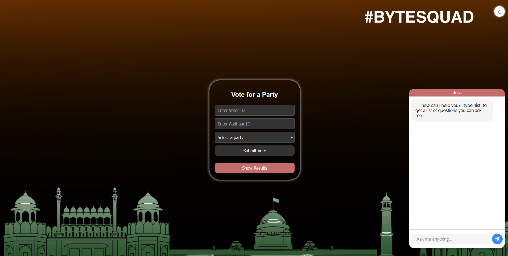
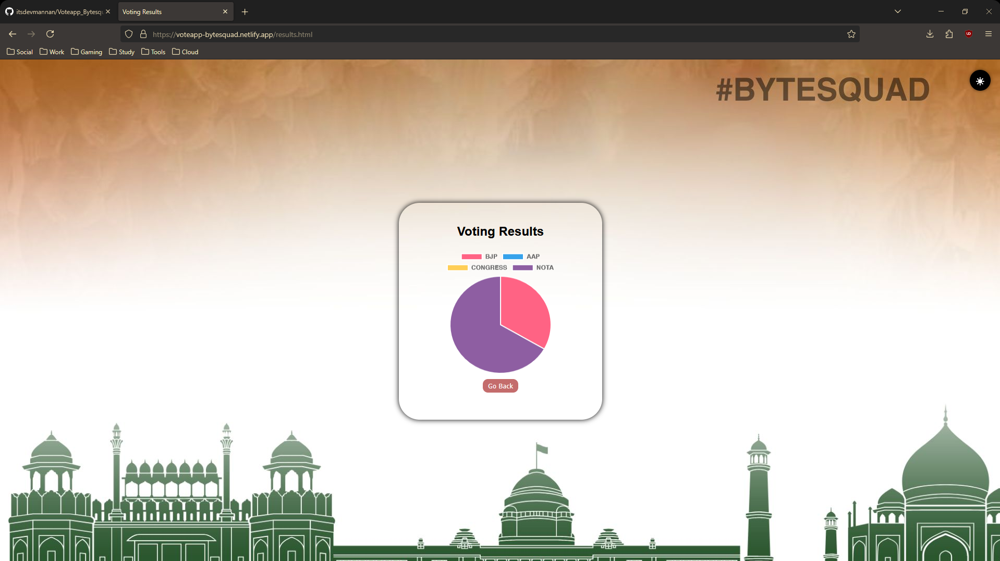

# 🗳️ Voting App  
A simple and interactive web-based voting app where users can cast votes and view real-time results. Built to explore core web development and backend integration concepts.

---

## ✨ Features
- User-friendly voting interface  
- Real-time vote count updates  
- Secure and simple vote submission logic  
- Responsive design for all screen sizes  

---

## 🛠️ Tech Stack
- **Frontend:** HTML, CSS, JavaScript  
- **Backend:** Python (`aiohttp`)  
- **Database:** SQLite  
- **Chatbot Integration:** Gemini API (1.5 Pro)  

---

## 🚀 Getting Started

1. Clone the repository:  
   `git clone https://github.com/itsdevmannan/Voteapp_Bytesquad`

2. Navigate to the project folder:  
   `cd Voteapp_Bytesquad`

3. Run the backend:  
   Open and run `main.py`

4. Open the frontend:  
   Go to [https://voteapp-bytesquad.netlify.app/](https://voteapp-bytesquad.netlify.app/) in your browser

---

## 📸 Screenshots  
  
  

---

## 📌 Key Points 
- [ ] user authentication  
- [ ] Store vote data persistently  
- [ ] Add results graph/chart  
- [ ] Implement dark mode  

---

## 🧠 Learnings  
Throughout this project, we explored:
- DOM manipulation using JavaScript  
- Handling form inputs and event listeners  
- Asynchronous Python backend with `aiohttp`  
- Working with Gemini API for chatbot features  
- Managing frontend-backend communication  

---

## 🤝 Contributing  
Pull requests are welcome!  
If you have suggestions for improvements, feel free to open an issue or submit a PR.  
Before contributing, please **test the project** on your system to ensure everything runs smoothly.

---

## 👥 Team - ByteSquad | Jamia Hamdard

- **Mannan** — Team Leader & Full-Stack Coordination  
- **Ahmad** — Backend Developer | Gemini API Integration  
- **Zainab** — Frontend Developer | UI Implementation  
- **Zoha** — Designer & Frontend Developer | UX & Aesthetics  

> We're a passionate tech team from Jamia Hamdard, building projects that solve real problems and push our skills further every day.
